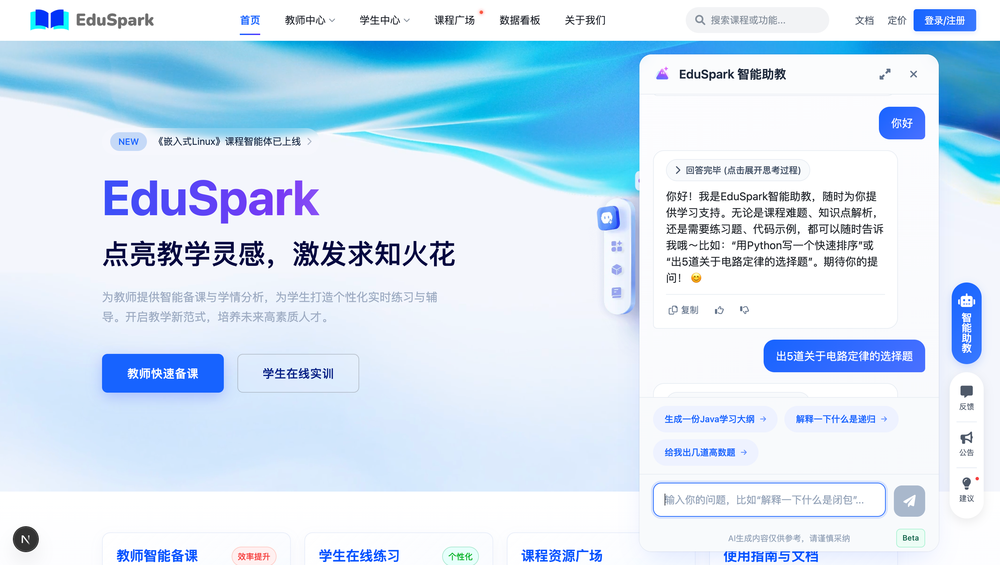

<p align="center">
  
</p>
<h1 align="center">EduSpark Frontend 🚀✨</h1>

<p align="center">
  <strong>一款AI驱动的教学实训平台，为教师和学生双向赋能，重塑智能教育未来。</strong>
</p>

<p align="center">
  
  
  
  
  
  
</p>

<p align="center">
  <a href="#-核心亮点">核心亮点</a> •
  <a href="#-技术栈">技术栈</a> •
  <a href="#-快速开始">快速开始</a> •
  <a href="#-docker-部署">Docker部署</a> •
  <a href="#-项目结构解析">项目结构</a> •
  <a href="#-贡献">贡献</a>
</p>

---

欢迎来到 **EduSpark** 前端项目！这是一个基于 **Next.js 15 (App Router)** 构建的、现代化、高性能的前端应用，是整个EduSpark智能教学实训平台的用户交互核心。

`EduSpark` 旨在响应国家教育数字化战略，通过我们创新的**混合A2A智能体架构**，深度融合大语言模型与实训教学。我们为教师提供一键式智能备课与学情分析工具，为学生打造全天候的个性化练习与实时辅导伙伴，致力于从根本上解决传统教学模式的痛点，推动实训教学向智能化、自适应化转型。



### ✨ 核心亮点 (Key Features)

*   **👨‍🏫 教师端 (Teacher's Cockpit):**
    *   **AI智能出题**: 基于课程知识库，一键生成多样化、高质量的练习题和考试卷。
    *   **可视化学情分析**: 通过动态图表直观展示学生学习进度、知识点掌握情况和常见错误，为教学决策提供数据支撑。
    *   **全流程课程管理**: 从课程创建、大纲编排，到班级管理、作业发布，提供一站式教学管理工具。
    *   **动态知识库构建**: 支持多种格式文档上传，并通过异步处理流水线，构建可供AI调用的动态知识库。

*   **👨‍🎓 学生端 (Student's Companion):**
    *   **个性化AI助教**: 7x24小时在线，基于课程上下文提供精准、可溯源的知识问答。
    *   **自适应练习中心**: 系统可根据学情推荐练习，并提供即时反馈与智能纠错。
    *   **Agent广场与排行榜**: 探索由社区创建的、覆盖不同学科和用途的趣味学习智能体。

*   **🤖 AI原生架构 (AI-Native Architecture):**
    *   前端UI与后端**混合A2A智能体架构**深度协同，为AI能力的呈现提供最佳交互体验。
    *   广泛应用**流式响应 (Streaming)**，无论是AI问答还是内容生成，都能提供流畅的“打字机”效果，极大提升用户感知性能。

*   **现代化工程实践 (Modern Engineering):**
    *   采用**特性切片 (Feature-Sliced)** 设计，代码结构清晰，高度内聚，易于维护和扩展。
    *   全面的**TypeScript**覆盖和精细的类型定义，保证了代码的健壮性和可读性。
    *   基于**Docker**的多阶段构建，实现了一键式、标准化的生产环境部署。

### 🛠️ 技术栈 (Tech Stack)

| 类别 | 技术 / 库 |
| :--- | :--- |
| **核心框架** | `Next.js 15` (App Router), `React 19` |
| **开发语言** | `TypeScript 5` |
| **状态管理** | `Zustand 5`, `Immer` |
| **UI & 动画** | `CSS Modules`, `Framer Motion` |
| **数据可视化** | `ECharts for React` |
| **API 通信** | `Axios` (封装于 `apiClient`) |
| **代码规范** | `ESLint` |
| **包管理器** | `pnpm` |
| **部署** | `Docker`, `Nginx` |

### 🚀 快速开始 (Getting Started)

请遵循以下步骤在您的本地环境中快速启动并运行 `EduSpark` 前端项目。

#### 1. 环境准备
确保您的开发环境中已安装以下软件：
*   [Node.js](https://nodejs.org/) (版本 `v18.0` 或更高)
*   [pnpm](https://pnpm.io/) (推荐的包管理器)
*   [Git](https://git-scm.com/)

#### 2. 克隆项目
```bash
git clone https://github.com/azure12355/edu-spark.git
cd edu-spark # 进入前端项目目录
```

#### 3. 安装依赖
本项目使用 `pnpm` 进行依赖管理，它能提供更快的安装速度和更高效的磁盘空间利用。
```bash
pnpm install
```

#### 4. 配置环境变量
为了让前端应用能够与后端服务和第三方API正常通信，您需要配置环境变量。

首先，将项目根目录下的 `.env.local.example` 文件复制一份并重命名为 `.env.local`：
```bash
cp .env.local.example .env.local
```
然后，使用文本编辑器打开 `.env.local` 文件，并填入您的真实配置信息：
```dotenv
# 后端API服务的地址 (本地开发时，通常指向后端服务的地址)
NEXT_PUBLIC_API_BASE_URL="http://localhost:8101/api"

# 用于前端独立功能（如富文本编辑器）的第三方API Key
# 例如，TinyMCE 的 API Key
NEXT_PUBLIC_TINYMCE_API_KEY="your-tinymce-api-key"

# (可选) 如果前端某些轻量级交互直连AI模型，请配置相关Key
ZHIPUAI_API_KEY="your-zhipuai-api-key"
```
> 💡 **提示**: `NEXT_PUBLIC_` 前缀的变量会暴露在浏览器端，请勿在此处存放任何敏感的私钥。敏感密钥应由后端服务管理。

#### 5. 启动开发服务器
一切就绪！运行以下命令启动开发服务器：
```bash
pnpm dev
```
项目将以 **Turbopack** 模式启动，为您带来极致的开发体验。

现在，打开您的浏览器并访问 [http://localhost:3000](http://localhost:3000)，您就能看到运行中的 `EduSpark` 平台了！🎉

---

### 🐳 Docker 部署 (Docker Deployment)

对于生产环境，我们强烈推荐使用 Docker 进行部署。项目已包含为前端优化的多阶段构建 `Dockerfile`。

#### 1. 构建前端 Docker 镜像
在项目根目录运行以下命令。此命令已针对跨平台构建进行了优化，确保在任何CPU架构（如 M1/M2 Mac）上都能构建出可在标准 x86-64 Linux 服务器上运行的镜像。

```bash
docker build \
  --platform linux/amd64 \
  --build-arg NEXT_PUBLIC_API_BASE_URL="https://your-production-api-url.com/api" \
  --build-arg NEXT_PUBLIC_TINYMCE_API_KEY="your-production-tinymce-key" \
  -t your-dockerhub-username/eduspark-frontend:latest \
  .
```
*   `--platform`: 指定构建的目标平台。
*   `--build-arg`: 安全地在**构建时**传递公共环境变量。
*   `-t`: 为您的镜像打上一个易于识别的标签。

#### 2. 推送镜像到仓库
```bash
docker push your-dockerhub-username/eduspark-frontend:latest
```

#### 3. 在服务器上运行容器
在您的服务器上（假设后端服务已在运行），执行以下命令来启动前端容器。
```bash
docker run -d \
  --name eduspark-frontend-container \
  -p 3000:3000 \
  -e ZHIPUAI_API_KEY="your-production-zhipuai-key" \
  --restart always \
  your-dockerhub-username/eduspark-frontend:latest
```
*   `-d`: 后台运行容器。
*   `-p`: 将服务器的3000端口映射到容器的3000端口。
*   `-e`: 在**运行时**安全地注入**服务端**环境变量。
*   `--restart always`: 保证容器在意外退出后能自动重启，提高服务可用性。

部署完成后，建议通过 Nginx 等反向代理配置域名，即可对外提供稳定服务。

---

### 📂 项目结构解析

本项目的代码结构遵循**特性切片 (Feature-Sliced Design)** 的思想，清晰且可扩展。

```
edu-spark/
├── public/                 # 静态资源 (图片, 视频, 图标)
├── src/
│   ├── app/                # Next.js App Router 核心目录，负责页面路由和布局
│   │   ├── (home)/         # 平台主页、历史记录等路由组
│   │   ├── student/        # 学生端所有页面路由
│   │   └── teacher/        # 教师端所有页面路由
│   ├── features/           # ✨ 核心业务功能模块
│   │   ├── home/           # 平台主页相关组件
│   │   ├── student/        # 学生端功能组件 (如练习广场、首页)
│   │   └── teacher/        # 教师端功能组件 (如AI出题、课程管理)
│   ├── shared/             # ✨ 全局共享模块
│   │   ├── api/            # API客户端和服务封装
│   │   ├── components/     # 可在任何地方复用的基础UI组件 (Button, Modal)
│   │   ├── hooks/          # 可复用的自定义Hooks (useToast, useDebounce)
│   │   ├── lib/            # 公共函数、常量、模拟数据
│   │   ├── services/       # 封装对后端API的调用
│   │   └── types/          # 全局TypeScript类型定义 (DTO, VO, Enums)
│   └── widgets/            # ✨ 复杂、自包含的UI模块 (如通用聊天窗口)
├── .env.local              # 本地环境变量 (重要且不应提交到Git)
├── Dockerfile              # 前端 Docker 构建文件
├── next.config.ts          # Next.js 配置文件
└── package.json            # 项目依赖与脚本
```

---

### 🤝 贡献 (Contributing)

我们热烈欢迎任何形式的贡献！如果您有任何好的想法或者发现了Bug，请随时提交 Pull Request 或创建 Issue。

1.  Fork 本仓库
2.  创建您的新分支 (`git checkout -b feature/AmazingFeature`)
3.  提交您的更改 (`git commit -m 'Add some AmazingFeature'`)
4.  推送到分支 (`git push origin feature/AmazingFeature`)
5.  打开一个 Pull Request

---

### 📄 许可证 (License)

本项目采用 [MIT License](LICENSE.md) 授权。

---

### 🙏 致谢 (Acknowledgements)

*   感谢所有为本项目提供灵感的开源项目和教育工作者。
*   特别感谢 [Next.js](https://nextjs.org/), [Spring](https://spring.io/), 以及各大模型开源社区的卓越贡献。

---

如果 `EduSpark` 对您有所启发，请不要吝啬您的 Star ⭐！